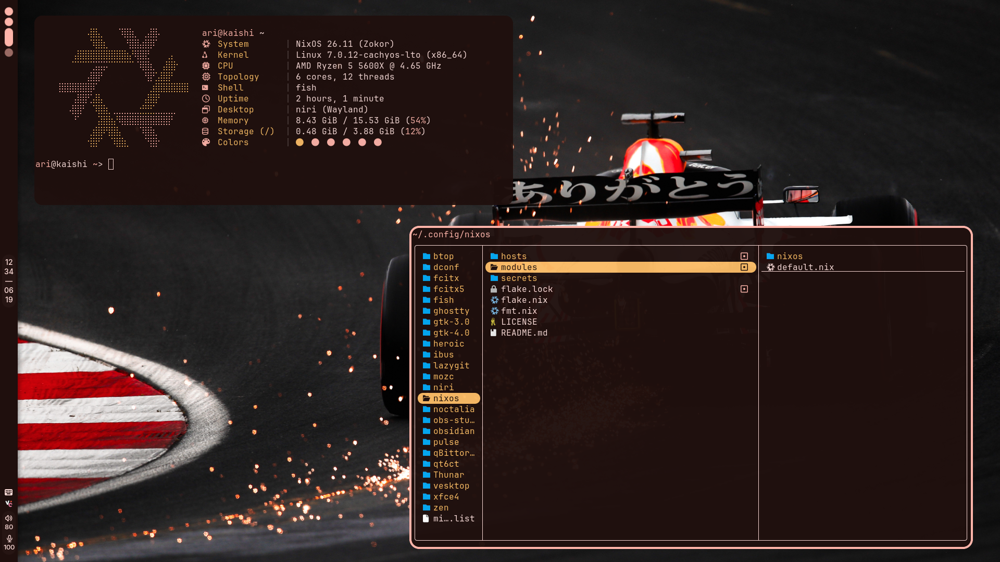

# NixOS

My personal NixOS configuration built against unstable with
[flake-parts](https://github.com/hercules-ci/flake-parts).



## Structure

```txt
.
├── hosts/
│   ├── iso
│   ├── kaishi
│   └── katei
│
├── modules/
│   └── nixos/
│       ├── base/
│       │   ├── programs
│       │   └── system
│       ├── desktop/
│       │   ├── programs
│       │   └── system
│       └── server/
│           ├── programs
│           └── system
│
├── secrets/
│   └── secrets.yaml
│
├── flake.nix
└── fmt.nix
```

## Notable Features

- [preservation](https://github.com/nix-community/preservation)
- [disko](https://github.com/nix-community/disko)
- [cachyos-kernel](https://github.com/xddxdd/nix-cachyos-kernel)
- [sops-nix](https://github.com/Mic92/sops-nix)
- [hjem](https://github.com/feel-co/hjem)
- NNN ([NixOS](https://nixos.org), [Niri](https://github.com/niri-wm/niri),
  [Noctalia](https://github.com/noctalia-dev/noctalia))

## License

This project is licensed under BSD-3-Clause.
